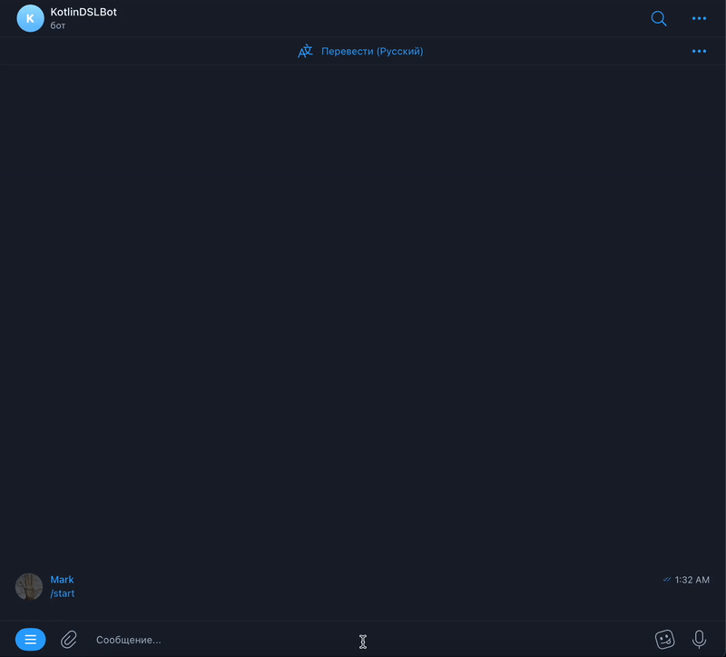

# tgbot-fsm-template

This is a template for creating a 1-2-1 bot with states using Kotlin and Gradle.



## Getting Started

To get started, you will need to clone this repository.

### Prerequisites

You will need to have the following installed:

-   JDK 11 or higher
-   Kotlin
-   Gradle

### Usage

1.  Create a new Telegram bot using BotFather and obtain the bot token.
2. Update the `Config.kt` file with your bot token and other settings as needed.

```kotlin
object Constants {
    const val DATABASE_NAME = "database/bot_database.db"
    const val BOT_API_KEY = "<your-bot-api-key>"
    const val uploadStringsPath: String = "<your-path>"
    const val uploadUrlsPath: String = "<your-path>"
    val updateDuration: Duration = 5.minutes
}
```

This file defines several constants that are used throughout the project:

-   `DATABASE_NAME` is the name of the SQLite database file.
-   `BOT_API_KEY` is the API key for your Telegram bot.
-   `uploadStringsPath` and `uploadUrlsPath` are the paths to the Google Sheets files that contain the strings and URLs to be used by the bot.
-   `updateDuration` is the duration between updates for the bot. The value is set to 5 minutes.
3. Setup states in `src/states/data.json`:

```json
{
    "startState": "HelloMessage",
    "defaultState": "MainMenu",

    "commands": [
        {
            "command": "start",
            "description": "The command will return you to the main menu"
        }
    ],

    "states": [
        {
            "name": "HelloMessage",
            "type": "actions",
            "actions": [
                {
                    "type": "sendMessage",
                    "messageKey": "HelloMessage.message",
                    "delayAfter": 1000
                },
                {
                    "type": "route",
                    "nextState": "MainMenu"
                }
            ]
        },
        {
            "afterCommand": "start",
            "name": "MainMenu",
            "type": "menu",
            "menu" : {
                "messageKey": "MainMenu.enterText",
                "errorMessageKey": "MainMenu.errorText",
                "elements": [
                    {
                        "description": "Say joke",
                        "textKey": "MainMenu.sayJoke",
                        "actions": [
                            {
                                "type": "route",
                                "nextState": "SayJoke"
                            }
                        ]
                    },
                    {
                        "description": "Calculate weeks between date of birth and current date",
                        "textKey": "MainMenu.weekBetween",
                        "actions": [
                            {
                                "type": "route",
                                "nextState": "WeekBetweenBirthdayAndTodayEnter"
                            }
                        ]
                    },
                    {
                        "description": "Send Lorem file",
                        "textKey": "MainMenu.sendLorem",
                        "actions": [
                            {
                                "type": "route",
                                "nextState": "LoremFile"
                            }
                        ]
                    }
                ]
            }
        },
        {
            "name": "SayJoke",
            "type": "actions",
            "actions": [
                {
                    "type": "sendMessage",
                    "delayAfter": 1000,
                    "messageKey": "SayJoke.joke"
                },
                {
                    "type": "route",
                    "nextState": "MainMenu"
                }
            ]
        },
        {
            "name": "LoremFile",
            "type": "actions",
            "actions": [
                {
                    "type": "sendDocument",
                    "delayAfter": 1000,
                    "messageKey": "Lorem.message",
                    "documentKey": "url.lorem"
                },
                {
                    "type": "route",
                    "nextState": "MainMenu"
                }
            ]
        },


        {
            "name": "WeekBetweenBirthdayAndTodayEnter",
            "type": "enter",
            "actions": [
                {
                    "type": "sendMessage",
                    "messageKey": "Birthdate.enterText"
                },
                {
                    "type": "sendWarningMessage",
                    "messageKey": "Birthdate.warningText"
                }
            ],
            "enter": {
                "validation": {
                    "errorTextKey": "Common.invalidDataFormat",
                    "validations": [
                        {
                            "type": "regex",
                            "regex" : "[0-9]{2}/[0-9]{2}/[0-9]{4}"
                        },
                        {
                            "type": "regex",
                            "regex" : "[0-9]{2}.[0-9]{2}.[0-9]{4}"
                        },
                        {
                            "type": "regex",
                            "regex" : "[0-9]{2}-[0-9]{2}-[0-9]{4}"
                        }
                    ]
                },
                "enterAction": {
                    "type": "custom",
                    "name": "saveOrUpdate",

                    "infoType": "WeekCalculation",
                    "key": "date",
                    "valueType": "date"
                },
                "afterActions": [
                    {
                        "type": "route",
                        "nextState": "SendCalculatedWeeks"
                    }
                ]
            },
            "keyboard": [
                {
                    "description": "Route back",
                    "textKey": "Common.back",
                    "actions": [
                        {
                            "type": "route",
                            "nextState": "MainMenu"
                        }
                    ]
                }
            ]
        },
        {
            "name": "SendCalculatedWeeks",
            "type": "actions",
            "actions": [
                {
                    "type": "custom",
                    "name": "sendCalculatedText",

                    "infoType": "WeekCalculation",
                    "scriptName": "calculateWeeksScript"
                },
                {
                    "type": "route",
                    "nextState": "MainMenu"
                }
            ]
        }
    ]
}

```

This example JSON file describes a state machine used for creating chatbots. It defines an initial state "HelloMessage" in which the bot sends a welcome message and transitions to the main menu "MainMenu". The main menu has three items defined, each of which performs a specific action such as sending a joke or a Lorem Ipsum file, or calculating the number of weeks between the user's birthday and the current date.

The state machine is defined using several JSON blocks, including "startState" and "defaultState", which define the initial and default states, respectively, as well as the "commands" and "states" blocks, which define the bot's commands and states, respectively. In each "states" block, states and actions that are performed in each state are defined.

This JSON file can be used to create a chatbot with a main menu with multiple options, and the ability to calculate the number of weeks between the user's birthday and the current date. It can also be extended to add additional states and actions.

4. Build and run the root application

## DSL

In this project, a DSL was created in Kotlin for describing bot states.

```kotlin

fun generateBotData(): BotData = botData(
    startState = "HelloMessage",
    defaultState = "MainMenu"
) {

    addCommands {
        "start".description("The command will return you to the main menu")
    }

    addStates {

        "HelloMessage".actionsState {
            actions {
                "HelloMessage.message".sendMessage {
                    delayAfter = 1000
                }
                "Main Menu".route()
            }
        }

        "MainMenu".menuState {
            afterCommand = "start"
            menuData(
                messageKey = "MainMenu.enterText",
                errorMessageKey = "MainMenu.errorText"
            ) {
                addElements {
                    "Say joke".addElementWithActions("MainMenu.sayJoke") {
                        "SayJoke".route()
                    }

                    "Calculate weeks between date of birth and current date".addElementWithActions("MainMenu.weekBetween") {
                        "WeekBetweenBirthdayAndTodayEnter".route()
                    }

                    "Send Lorem file".addElementWithActions("MainMenu.sendLorem") {
                        "LoremFile".route()
                    }
                }
            }
        }

		// ...
    }
}

```

To use the DSL, you need to call the `generateBotData()` function, which will return an object of type BotData. Inside the `generateBotData()` function, you can use several methods to describe the bot's states, commands, and menu items.

The `botData()` method takes two parameters - `startState` and `defaultState`, which correspond to the initial and default states of the bot, respectively.

Next, you can use the `addCommands()` and `addStates()` methods to add bot commands and states, respectively.

The `addCommands()` method allows you to add commands that can be used in different bot states. Each command must have a unique name and can contain a description.

The `addStates()` method allows you to add bot states. Depending on the type of state (`actionsState`, `menuState`, etc.), you can add corresponding elements such as actions, menus, etc.

The `actionsState()` method allows you to add actions for a specific state. Inside this method, you can add actions() methods that define actions performed by the bot in this state. Each action has a unique name and can contain parameters such as delayAfter, which determines the delay after the action is performed.

The `menuState()` method allows you to add menu items for a specific state. Inside this method, you can add a menuData() method that defines the contents of the menu, including the text message displayed to the user and menu items.

The `menuData()` method allows you to add menu items. Each item has a unique name and can contain parameters such as route(), which determines the transition to another state when the item is selected.